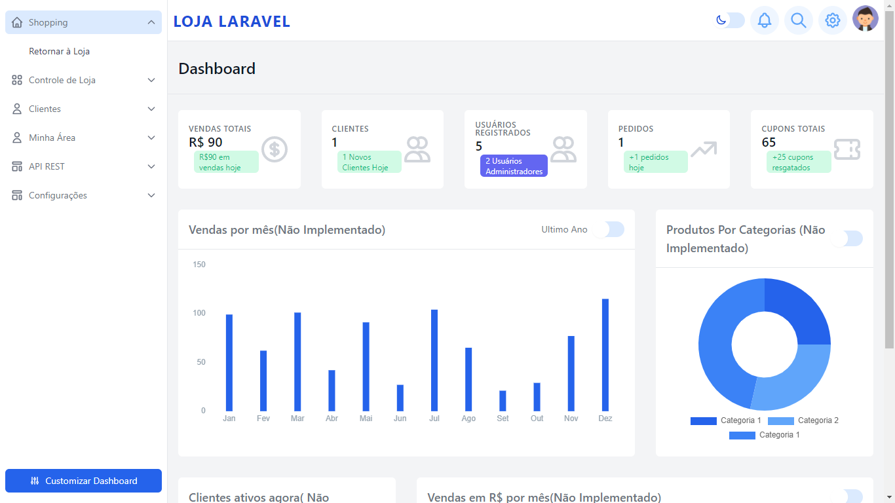
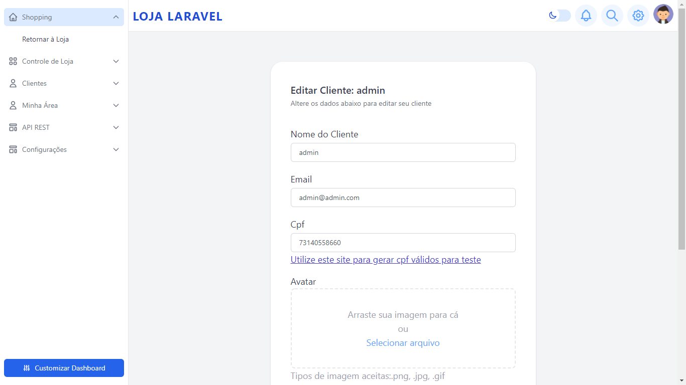

## Laravel - Teste Processo Seletivo - Vaga Remota - Laravel 

Protótipo simples de uma aplicação em Laravel que cadastra produtos, clientes e simula compras.

  

- [Veja a Demonstração](https://lojadev.algoritmo9.site).

-Login Admin
- login: admin@admin.com
- senha: password

Login cliente 
- login: cliente@cliente.com
- senha: password
ou cadastre um novo usuário

## Instalação

 - Clone para o seu servidor
 - Insira suas credenciais no arquivo .env
 - Tenha o node a partir da v12 instalado
 - Rode sudo npm install e sudo npm run dev para que o frontend seja compilado
 - Rode php artisan migrate para criar as tabelas necessárias
 - Rode php artisan db:seed para criar automaticamente produtos, categorias e usuários
	- Usuário admin criado : admin@admin.com / password  - Usuário cliente criado: cliente@cliente.com
 - Certifique-se que possui acesso para escrita na pasta /storage

 
 - Em alguns casos pode ser necessário regenerar o link storage na pasta pública. Delete a pasta /storage localizado em /public e rode o comando: php artisan storage:link

### Simulação de Compras

   Para esse teste, não foi incluido nenhum gateway de pagamento.
   Credenciais para simular uma compra, após inclusão de produto no carrinho:
    - Numero do cartão: 4242424242424242 - Compra só será aprovada se esse numero do cartão for inserido, demais dados do cartão poderá ser qualquer valor.
	- CPF: O sistema verificará se cpf é unico e válido. Insira apenas números no cpf. Você pode gerar um cpf ficticio em : geradordecpf.org
	
   # Cupons
   
   Para utilizar cupom de desconto no momento da compra, crie antes no painel do admin alguns cupons para ser usado para um determidado produto e insira o número do cupom no momento da compra.
   O valor total com desconto aparecerá automaticamente.
 
### Api

   Utilize ferramenta como o Postman para de forma autenticada via token, realizar uma edição de unico produto, listar todos ou listar por id.
   Também é possivel retornar sem autenticação, via url o json de todos os produtos cadastrados.
   Criação e exclusão para produtos via api ainda não implementadas.
   Para criação do token, acesse o menu Api Tokens e cadastre uma nova chave.
   
- *GET: /api/v1/produtos -* - Retorna em json, via url, todos os produtos cadastrados no sistema, sem necessidade de autenticação
- *GET: /api/v1/produtos/< id-produto-aqui > -* - Retorna em json, via url, um único produto.
- *GET: /api/v1/autenticado/produtos -* (Requer Token com permissão de leitura) - Retorna a lista de produtos se token informado no header da requisição.
- *GET: /api/v1/produtos/autenticado/< id-produto-aqui > -* (Requer Token com permissão de leitura) - Retorna um unico produto se token informado no header da requisição.
- *POST: /api/autenticado/editar/produtos/< id-produto-aqui > -* (Requer Token com permissão de edição) - Edita um produto se token informado no header da requisição. 

## Capturas de tela

  

  

  

  

  

  

  

  

  

  

  

  

  

  

  

  

  

  

  

  

  

  

  

  

  

  

  

  

  

  

  

  

  

  

  

  

  

  

  

  

## 2021

