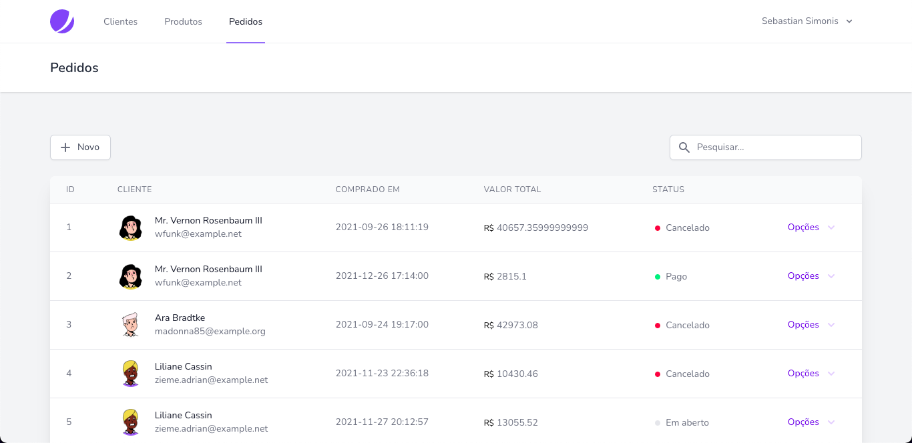
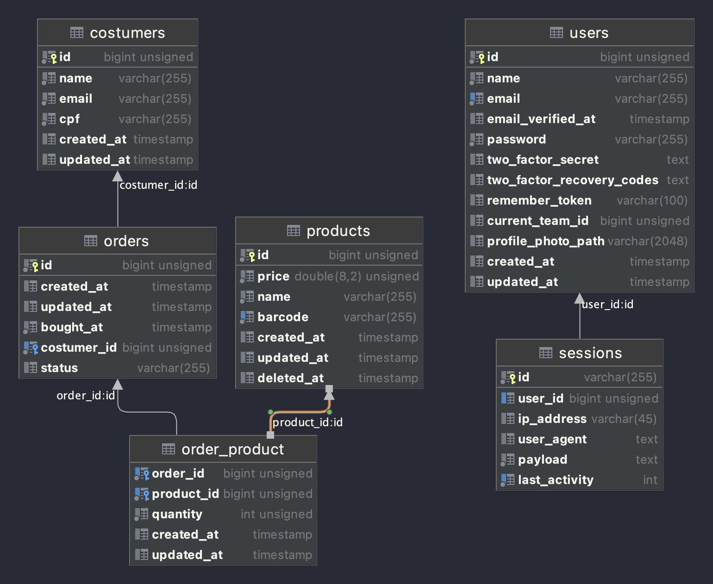

#Teste entrevista dev. PHP Jr.

Esta aplicação foi desenvolvida para a entrevista de dev. PHP Jr. da dotlib.com.

---




## Requerimentos

- Docker em um ambiente de desenvolvimento com macOS ou Linux, ou configuração manual no Windows.
- Composer.

## Instalação e execução com Docker (Linux/MacOS) 

Crie um arquivo `.env` a partir do arquivo `.env.example`. Mude as portas da aplicação para livres em sua máquina.

A partir da raiz do projeto, execute os comandos:
```bash
composer install

./vendor/bin/sail up -d
./vendor/bin/sail artisan key:generate
./vendor/bin/sail artisan migrate --seed
./vendor/bin/sail yarn run prod
```

A aplicação tem o **usuário** e **senha** padrão:

usuario@exemplo.com
| 12345678

---

Referência e requerimentos: [README.md](../README.md)

Esquema do banco de dados normalizado:



## Descrição da aplicação

O projeto usa a seguinte stack:
- [Laravel Jetstream](https://jetstream.laravel.com/): Laravel Sanctum + Inertia.js + Vue.js
- [Laravel Sail](https://laravel.com/docs/9.x/sail): Ambiente docker padrão

As views são controladas pelo Inertia.js no backend e renderizadas pelo Vue.js no frontend.
A existência de um protótipo de frontend em Vue facilitará a conversão futura da aplicação em uma SPA.

Os testes de unidade estão passando mesmo após as refatorações. Os de integração não estão passando.

## Descrição de requisitos da aplicação

- [x] Um usuário pode cadastrar um cliente
- [x] Um usuário pode editar todos os campos de um cliente
- [x] Um usuário pode excluir um cliente
- [x] Um usuário pode listar todos os clientes
- [x] Um usuário pode procurar clientes por nome, email ou cpf


- [x] Um usuário pode cadastrar um produto
- [x] Um usuário pode editar todos os campos de um produto
- [x] Um usuário pode excluir um produto
- [x] Um usuário pode listar todos os produtos
- [x] Um usuário pode procurar produtos por nome ou código de barras


- [x] Um usuário pode cadastrar uma venda escolhendo um cliente em uma lista de clientes, uma data e um status de uma lista de possíveis status
- [x] Um usuário pode adicionar produtos em uma venda, escolhendo a partir de uma lista de produtos
- [x] Um usuário pode listar todas as vendas de um cliente
- [x] Um usuário pode apagar uma venda
- [ ] Um usuário pode remover um produto de uma venda (existe rota)
- [ ] Um usuário pode editar quantidade de um produto de uma venda