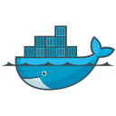
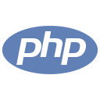

[](http://www.dotlib.com)

# Teste para candidatos à vaga de Desenvolvedor PHP Júnior

Olá, me chamo Luan Matheus Silva Farias, sou desenvolvedor fullstack com as linguagens PHP e Javascript. Além disso sou estudante do curso de ciência da computação e trago aqui o desafio concluído.

## ⚙ Instalação

Se você deseja instalar o projeto localmente, siga os seguintes passos.

### Requisitos

Os requisitos para rodar esse aplicativo são.

-  &nbsp; [Git](https://git-scm.com)
-  &nbsp; [Docker](https://docker.com)
-  &nbsp; [PHP](https://php.net)
-  &nbsp; [Composer](https://getcomposer.org/)
-  &nbsp; [Insomnia](https://insomnia.rest) (Caso queira testar a api)
-  &nbsp; [Visual Studio Code](https://code.visualstudio.com) (Opcional, editor de códigos que utilizei para desenvolver e caso queira ver o código)

Embora o projeto utilize o docker, ele utiliza a depedência sail do composer que facilita para criar o container com o docker utilizando o laravel e o php.

### Como instalar e rodar o projeto

Para instalar você deve serguir os seguintes passos:

```bash
# Clonar repositório
$ git clone git@github.com:lunsmat/teste-desenvolvedor-php.git

# Entre na pasta do projeto
$ cd teste-desenvolvedor-php

# Mude para a branch do desafio
$ git checkout luan_matheus_silva_farias

# Instalar depedências
$ composer install
# Caso dê erro no composer install tente desta maneira
$ composer install --ignore-platform-reqs
# Isso não afetará o funcionamento do projeto, afinal instalamos depedências pois por meio delas usaremos o docker

# Copie e cole o arquivo .env.example para o .env
# Após isso, rode o seguinte comando
$ php artisan key:generate

# Tenha certeza que o docker está ativo antes dos próximos passos

# Faça o alias para o sail (ele irá utilizar o docker)
$ alias sail='[ -f sail ] && bash sail || bash vendor/bin/sail'
# Obs: O projeto irá rodar na porta 80, tenha certeza de que ela está livre

# Rode os seguintes comandos para iniciar o projeto no docker
$ sail up -d
$ sail yarn # Instalará as depedências para buildar o javascript do frontend
$ sail yarn dev # Buildará o javascript para o frontend

# Agora vamos rodar as migrations e rodar as seeds
$ sail artisan migrate
$ sail artisan db:seed

# Acesse o projeto no seu localhost na porta 80
# http://localhost
# Logue com o email: `user@default.com` e senha: `password`
# Pode testar a vontade
```

Além das telas do projeto, ele também inclui uma api.

Para testar a API você tem que:

- Abrir o aplicativo do Insomnia (preferencialmente)
- Vá para `Application > Preferences > Data > Import Data > From File > Select the Insomnia File`.
- Importe o arquivo `insomnia_design_document.json` que está na raíz do projeto.
- Mude para o ambiente de desenvolvimento, e na aba de design você poderá ir testando. 
    - Ao fazer o login, prefira optar por mudar a variavel de ambiente `access_token` para o seu token de api, assim as rotas privadas funcionaram ao invés de mudar todas manualmente.

## 🔮 Author


[Luan Farias](https://github.com/lunsmat)

Made with 💜 by Luan Farias. Contact-me:

- 📩 [Email: luan.farias_bvs@outlook.com](mailto:luan.farias_bvs@outlook.com)
- 💼 [LinkedIn: Luan Farias](https://www.linkedin.com/in/luan-farias-08572219b/)
